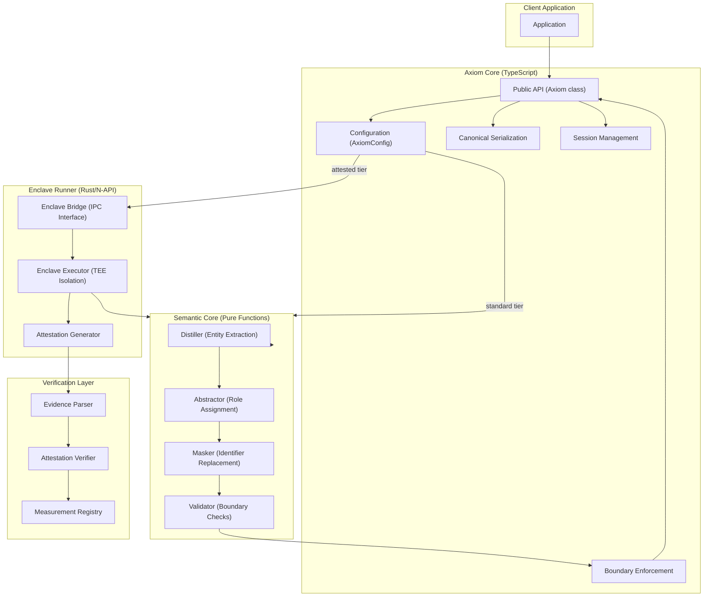

# Axiom Core v0.x Architecture

**Note:** Enclave/attested sections are experimental preview only. They are opt-in, non-production, and do not provide v0.x guarantees.

## Overview

Axiom Core is a local-first, software-first semantic transformation infrastructure. It transforms raw local input into non-identifying semantic representations while enforcing strict boundary controls in software, with an experimental enclave preview for hardware isolation.

**Core Principles:**

- **Local-First**: No network dependencies in transformation logic
- **Hardware-Backed Security (preview)**: TEE isolation explored for attested tier
- **Explicit Boundaries**: Fail-closed, no silent downgrades
- **Attestation-Based Verification (preview)**: Evidence intended for verification
- **Deterministic**: Canonical serialization for reproducible outputs

## System Components



## Data Flow

### Standard Tier (Software-Only)

```
Raw Context
    ↓
[Axiom.reason()]
    ↓
Configuration Validation
    ↓
Session Creation
    ↓
┌─────────────────────────────┐
│  Semantic Transformation    │
│  ├─ Distill (Entities)      │
│  ├─ Abstract (Roles)        │
│  ├─ Mask (Identifiers)      │
│  └─ Validate (Boundaries)   │
└─────────────────────────────┘
    ↓
Canonical Serialization
    ↓
Output Hash Computation
    ↓
TransformedContext + Stats
```

### Attested Tier (TEE-Backed)

```
Raw Context + Config
    ↓
[Axiom.reason()]
    ↓
Configuration Validation
    ↓
Session Creation (with nonce)
    ↓
┌────────────────────────────────────────┐
│  Enclave Bridge (IPC/N-API)            │
│    ↓                                   │
│  ┌──────────────────────────────────┐  │
│  │  AMD SEV-SNP Enclave             │  │
│  │  ┌────────────────────────────┐  │  │
│  │  │  Semantic Transformation   │  │  │
│  │  │  (Isolated Execution)      │  │  │
│  │  └────────────────────────────┘  │  │
│  │    ↓                             │  │
│  │  Output Hash Generation          │  │
│  │    ↓                             │  │
│  │  Attestation Report Request      │  │
│  │    ↓                             │  │
│  │  Report Data Binding:            │  │
│  │   - session_id                   │  │
│  │   - config_hash                  │  │
│  │   - output_hash                  │  │
│  │    ↓                             │  │
│  │  AMD Platform Signs Report       │  │
│  │  (VCEK Signature)                │  │
│  └──────────────────────────────────┘  │
│    ↓                                   │
│  Evidence Extraction                   │
└────────────────────────────────────────┘
    ↓
TransformedContext + AttestationEvidence
    ↓
Return to Caller
```

### Verification Flow

```
AttestationEvidence + TransformedContext
    ↓
[AttestationVerifier.verify()]
    ↓
┌─────────────────────────────────────┐
│  Parse Attestation Report           │
│   ├─ Extract measurement            │
│   ├─ Extract report_data            │
│   ├─ Extract signature              │
│   └─ Extract certificates           │
└─────────────────────────────────────┘
    ↓
┌─────────────────────────────────────┐
│  Validate Claims                    │
│   ├─ Code Identity                  │
│   │   (measurement == expected)     │
│   ├─ Platform Auth                  │
│   │   (VCEK → ASK → ARK chain)      │
│   ├─ Session Binding                │
│   │   (hash(context) == outputHash) │
│   ├─ Config Binding                 │
│   │   (configHash == expected)      │
│   └─ Freshness                      │
│       (timestamp within maxAge)     │
└─────────────────────────────────────┘
    ↓
VerificationVerdict
 ├─ valid: boolean
 ├─ claims: {...}
 ├─ errors: string[]
 └─ warnings: string[]
```

## Module Breakdown

### 1. Public API (`src/core/axiom.ts`)

**Responsibilities:**
- Accept configuration and validate
- Coordinate execution (standard vs attested)
- Return results with optional attestation evidence

**Key Method:**
```typescript
async reason(input: ReasonInput): Promise<ReasonResult>
```

**Behavior:**
- Validates `AxiomConfig`
- Creates cryptographic session
- Routes to local or enclave execution based on `securityTier`
- Attaches attestation evidence if `securityTier === "attested"`
- Returns `TransformedContext` + optional `AttestationEvidence`

### 2. Semantic Core (`src/transform/`, `src/runtime/`)

**Pure Transformation Pipeline:**

1. **Distiller** (`distiller.ts`)
   - Extracts raw entities using deterministic heuristics
   - Pattern matching: capitalized sequences, numbers, dates, currency
   - Output: `RawEntity[]`

2. **Abstractor** (`abstraction.ts`)
   - Assigns semantic roles: Actor, Participant, Obligation, Value, Temporal
   - Builds explicit relations between entities
   - Output: `SemanticRepresentation { entities, relations }`

3. **Masker** (`masking.ts`)
   - Replaces identifiers with synthetic IDs (`ENTITY_0001`, etc.)
   - Verifies no raw data leakage
   - Output: `MaskedRepresentation`

4. **Boundary Validator** (`boundary.ts`)
   - Ensures raw input strings don't appear in output
   - Throws `BoundaryViolationError` on leakage
   - Final safety check before returning

**Executor** (`executor.ts`)
- Orchestrates the pipeline
- Routes to enclave if `attested` tier
- Falls back to local execution for `standard` tier
- Memory management (best-effort wiping)

### 3. Canonical Serialization (`src/core/canonical.ts`)

**Purpose:** Deterministic representation for hashing and verification.

**Rules:**
- Alphabetical key ordering
- Normalized number formats (no trailing zeros, consistent precision)
- Stable entity ordering (by `syntheticId`)
- Stable relation ordering (by `from`, `to`, `type`)
- No whitespace in output
- UTF-8 encoding

**Functions:**
```typescript
canonicalize(context: TransformedContext): string
hash(context: TransformedContext): string  // SHA-256
verifyEquivalence(a: TransformedContext, b: TransformedContext): boolean
createDigest(context: TransformedContext): ContextDigest
```

### 4. Session Management (`src/runtime/session.ts`)

**Purpose:** Bind execution to configuration, timestamp, and output.

**Session Lifecycle:**
1. Generate random 128-bit `sessionId`
2. Generate 256-bit `nonce`
3. Hash configuration → `configHash`
4. Track timestamp
5. Create `reportData` for TEE binding:
   ```
   reportData = SHA-256(sessionId || configHash || nonce || outputHash)
   ```

**Session Object:**
```typescript
{
  id: string,              // 128-bit hex
  configHash: string,      // SHA-256 of config
  nonce: string,           // 256-bit hex
  timestamp: number        // Unix ms
}
```

### 5. Enclave Bridge (`src/runtime/enclave-bridge.ts`)

**Purpose:** Abstract communication with native Rust enclave runner.

**Modes:**
- **Simulator**: Local execution, generates fake attestation reports (for development)
- **Native**: IPC/N-API to actual Rust runner (preview hardware)

**Interface:**
```typescript
class EnclaveBridge {
  async execute(input: EnclaveInput): Promise<EnclaveOutput>
}
```

**EnclaveInput:**
```typescript
{
  rawContext: string | string[],
  taskHint: string,
  policy: AxiomConfig,
  sessionId: string,
  nonce: string
}
```

**EnclaveOutput:**
```typescript
{
  transformedContext: TransformedContext,
  outputHash: string,
  attestationReport: Uint8Array,
  redactionStats: {
    entityCount: number,
    relationCount: number
  }
}
```

### 6. Attestation Layer (`src/attestation/`)

#### **Evidence (`types.ts`)**

```typescript
interface AttestationEvidence {
  platform: "sev-snp",
  report: Uint8Array,          // Raw AMD SEV-SNP report (1184 bytes)
  measurement: string,         // SHA-384 of enclave code
  configHash: string,          // SHA-256 of AxiomConfig
  sessionId: string,           // 128-bit hex
  outputHash: string,          // SHA-256 of TransformedContext
  timestamp: number,           // Unix ms
  signature?: Uint8Array,      // Optional additional signature
  version: "1.0"
}
```

#### **Parser (`parser.ts`)**

Extracts structured data from raw SEV-SNP report:
- Measurement (offset 0x170, 48 bytes)
- ReportData (offset 0x50, 64 bytes)
- Signature (offset 0x2A0, 512 bytes)
- Certificates (if present)

#### **Verifier (`verifier.ts`)**

Validates attestation evidence:

**Claims Checked:**
1. **Code Identity**: `measurement === expectedMeasurement`
2. **Platform Auth**: VCEK signature chain validates
3. **Session Binding**: `hash(transformedContext) === evidence.outputHash`
4. **Config Binding**: `evidence.configHash === expectedConfigHash` (if provided)
5. **Freshness**: `timestamp within maxAge` (default 5 minutes)
6. **Report Structure**: Report is well-formed and parseable

**Modes:**
- **Strict**: All claims must pass
- **Permissive**: Allow simulator reports with warnings

**Output:**
```typescript
interface VerificationVerdict {
  valid: boolean,
  platform: "sev-snp",
  measurement: string,
  claims: {
    codeIdentity: boolean,
    platformAuth: boolean,
    sessionBinding: boolean,
    freshness: boolean,
    reportStructure: boolean,
    configBinding: boolean
  },
  errors: string[],
  warnings: string[],
  verifiedAt: number
}
```

### 7. Boundary Enforcement

**Software Layer** (`src/runtime/boundary.ts`):
- Validates masked representation
- Checks that raw input doesn't appear in output
- Throws `BoundaryViolationError` on violation

**Hardware Layer** (Enclave):
- TEE isolation prevents raw data egress
- No filesystem access
- No network access
- Memory wiped on completion
- Attestation report binds output to execution

**Policy Enforcement** (`src/security/guarantees.ts`):
- `assertNoRawText(data)`: Throws if raw identifiers present
- `assertNoNetworkAccess()`: Static assertion (no network libs imported)

## Security Model

### Threat Model

**Assets to Protect:**
- Raw user context (documents, messages, records)
- Identity mappings (names ↔ entity IDs)
- Transformation pipeline internals (optional)

**Adversaries:**
1. **Network Attacker**: Observes/modifies traffic
   - Mitigation: No network calls from core
2. **Cloud Provider**: Honest-but-curious model provider
   - Mitigation: Only transformed context sent, raw stays local
3. **Host OS Attacker**: Inspects memory, filesystem, logs
   - Mitigation: TEE isolation in attested tier
4. **Malicious Integrator**: Accidentally sends raw data
   - Mitigation: Boundary validation, explicit errors

### Properties (v0.x)

**In-Scope:**
- Raw input never leaves device in SDK-controlled pathways
- Transformed context generated inside TEE when `enclave: "required"`
- Attestation evidence is intended to support verification of code identity and platform
- Explicit failure on unsafe conditions (no silent downgrades)
- Deterministic outputs (same input → same hash)

**Out-of-Scope:**
- Fully compromised firmware / physical attacks
- Side-channel attacks beyond baseline mitigations
- "Perfect secrecy" (semantic leakage is possible)
- Zero-knowledge proofs (deferred to v2.0)

### Configuration Safety Rules

| securityTier | enclave | Behavior |
|---|---|---|
| `"standard"` | `"none"` | Local execution, software boundary only |
| `"standard"` | `"auto"` | Use enclave if available, else local |
| `"standard"` | `"required"` | Use enclave, fail if unavailable |
| `"attested"` | `"none"` | **Invalid** (throws `ConfigurationError`) |
| `"attested"` | `"auto"` | Use enclave, fail closed if unavailable |
| `"attested"` | `"required"` | Use enclave, fail if unavailable |

## AMD SEV-SNP Integration

### Attestation Report Structure

AMD SEV-SNP attestation reports are 1184 bytes with the following key fields:

| Offset | Size | Field | Purpose |
|---|---|---|---|
| 0x000 | 4 | Version | Report format version |
| 0x004 | 4 | Guest Policy | VM policy flags |
| 0x170 | 48 | Measurement | SHA-384 of initial guest state |
| 0x050 | 64 | Report Data | Custom data (session binding) |
| 0x2A0 | 512 | Signature | ECDSA P-384 signature |

### Report Data Binding

The 64-byte `report_data` field is used to bind the attestation to the specific execution:

```
report_data = SHA-256(session_id || config_hash || output_hash || timestamp)
```

This ensures:
- Output cannot be swapped (bound to `output_hash`)
- Configuration cannot be changed (bound to `config_hash`)
- Session cannot be replayed (bound to unique `session_id` + `timestamp`)

### Signature Chain Validation

1. **Extract VCEK** (Versioned Chip Endorsement Key) from report
2. **Verify Report Signature**: `VCEK.verify(report_data, signature)`
3. **Verify VCEK Certificate**: Signed by ASK (AMD Signing Key)
4. **Verify ASK Certificate**: Signed by ARK (AMD Root Key)
5. **Verify ARK**: Known AMD root of trust

## Enclave Runner (Rust)

**Status:** v0.x includes TypeScript simulator; Rust runner is architecture-complete but not yet built.

### Planned Structure

```
enclave/runner/
  Cargo.toml                 # Rust project manifest
  src/
    lib.rs                   # N-API entry point
    enclave.rs               # SEV-SNP enclave wrapper
    transform.rs             # Semantic transformation (Rust port)
    attestation.rs           # AMD attestation API calls
    ipc.rs                   # TypeScript ↔ Rust bridge
  build.rs                   # Build script for N-API
```

### Key Dependencies

- `serde`, `serde_json`: Serialization
- `sha2`: Hashing
- `napi`, `napi-derive`: Node.js bindings
- AMD SEV-SNP SDK: Platform attestation

### N-API Interface

```rust
#[napi]
pub fn transform(input: Buffer) -> Result<Buffer> {
  // 1. Deserialize EnclaveInput
  // 2. Initialize SEV-SNP session
  // 3. Run transformation pipeline
  // 4. Generate attestation report
  // 5. Serialize EnclaveOutput
  // 6. Return to TypeScript
}
```

## Reproducible Builds

**Goal:** Same source → same binary → same measurement

### Requirements

1. **Fixed Toolchain**:
   - Rust version pinned in `rust-toolchain.toml`
   - Node.js version documented
   - TypeScript version pinned in `package.json`

2. **Deterministic Compilation**:
   - Rust: `RUSTFLAGS="-C link-arg=-Wl,--build-id=none"`
   - No timestamps in binaries
   - Stable dependency resolution

3. **Measurement Publication**:
   - Build enclave runner
   - Compute SHA-384 of binary
   - Publish to `measurements.json`
   - Sign with release key

### Verification

Users can:
1. Clone repository at specific tag
2. Build enclave runner with fixed toolchain
3. Compute measurement of output binary
4. Compare to published measurement in `measurements.json`
5. Use verified measurement as `expectedMeasurement` in verification

## Deployment Models

### Model 1: Confidential VM (Enterprise)

**Setup:**
- Client runs Axiom in AMD SEV-SNP VM they control
- Enclave runner executes inside VM
- TypeScript SDK communicates via local IPC

**Workflow:**
1. Application calls `axiom.reason({ context, task })`
2. SDK detects enclave availability
3. Transformation runs in SEV-SNP VM
4. Attestation evidence returned to application
5. Application sends transformed context + evidence to cloud LLM
6. Cloud LLM (or customer) verifies attestation before processing

**Benefits:**
- Client controls the VM (trust boundary)
- Cloud provider cannot access raw data
- Attestation proves execution environment

### Model 2: Endpoint (Future)

**Setup:**
- Axiom runs on user device with TEE support
- Mobile/desktop applications use SDK

**Considerations:**
- Different TEE platforms (Apple Secure Enclave, etc.)
- Binary distribution and updates
- Measurement verification on constrained devices

## API Reference

### Primary Interface

```typescript
import { Axiom } from "@axiom-infra/core";

const axiom = new Axiom({
  securityTier: "attested",
  enclave: "required",
  policyVersion: "v1",
  platform: {
    type: "sev-snp",
    verificationMode: "strict"
  }
});

const result = await axiom.reason({
  context: "John Doe signed a $50,000 contract with Acme Corp on 2026-01-15",
  task: "Analyze the business transaction",
  model: "gpt-4"  // Optional hint (SDK doesn't call model)
});

// result.transformedContext:
// {
//   entities: [
//     { syntheticId: "ENTITY_0001", role: "Actor", attributes: {...} },
//     { syntheticId: "ENTITY_0002", role: "Participant", attributes: {...} },
//     ...
//   ],
//   relations: [
//     { type: "signed", from: "ENTITY_0001", to: "ENTITY_0003" },
//     ...
//   ],
//   task: "Analyze the business transaction"
// }

// result.attestationEvidence (if attested tier):
// {
//   platform: "sev-snp",
//   report: Uint8Array(1184),
//   measurement: "abc123...",
//   sessionId: "def456...",
//   outputHash: "789xyz...",
//   ...
// }
```

### Verification

```typescript
import { AttestationVerifier } from "@axiom-infra/core";

const verifier = new AttestationVerifier();
const verdict = await verifier.verify(
  result.attestationEvidence,
  result.transformedContext,
  {
    expectedMeasurement: "abc123...",  // From measurements.json
    maxAge: 5 * 60 * 1000,              // 5 minutes
    mode: "strict"
  }
);

if (verdict.valid) {
  // Safe to use transformed context
  console.log("✓ Attestation verified");
  console.log("Measurement:", verdict.measurement);
  console.log("All claims:", verdict.claims);
} else {
  console.error("✗ Attestation failed");
  console.error("Errors:", verdict.errors);
}
```

## Error Handling

All errors are explicit and typed:

```typescript
try {
  const result = await axiom.reason({ context, task });
} catch (error) {
  if (error instanceof BoundaryViolationError) {
    // Raw data leaked through masking
  } else if (error instanceof TransformationError) {
    // Semantic transformation failed
  } else if (error instanceof ConfigurationError) {
    // Invalid configuration
  } else if (error instanceof SecurityInvariantError) {
    // Security assumption violated
  }
}
```

**No Silent Failures:**
- Invalid configuration → throw immediately
- Enclave unavailable (when required) → throw immediately
- Boundary violation → throw immediately
- Attestation verification fails → return `valid: false` with detailed errors

## Performance Characteristics

**v0.x Focus:** Correctness over performance

### Benchmarks (Indicative)

| Operation | Time | Notes |
|---|---|---|
| Local transformation (100 entities) | ~10ms | Pure JS/TS |
| Canonical serialization + hash | ~2ms | SHA-256 |
| Session creation | <1ms | Random generation |
| Enclave IPC round-trip | ~50ms | Simulator mode |
| Attestation verification | ~20ms | Signature chain validation |

**Bottlenecks:**
- Enclave IPC (round-trip overhead)
- Attestation report parsing (binary format)

**v1.x Optimizations:**
- Batch multiple transformations
- Persistent enclave sessions
- Async attestation verification

## Testing Strategy

### Test Tiers

1. **Unit Tests** (`tests/*.test.ts`)
   - Canonical serialization determinism
   - Boundary violation detection
   - Masking correctness

2. **Attestation Tests** (`tests/attestation.test.ts`)
   - Output tampering detection
   - Replay attack prevention
   - Measurement validation

3. **Integration Tests** (`tests/integration/`)
   - End-to-end attested flow
   - Enclave availability detection
   - Fail-closed behavior

4. **Platform Tests** (future)
   - Real SEV-SNP VM execution
   - Signature chain validation against AMD infrastructure

## Future Enhancements (v1.x and Beyond)

### v1.x (Near-Term)

- **Multi-Platform TEE Support**
  - Intel TDX
  - Apple Secure Enclave
  - Arm CCA

- **Remote Verification Service**
  - Cloud-based attestation verification
  - Measurement registry with automatic updates

- **Performance Optimizations**
  - Streaming transformation for large inputs
  - Persistent enclave sessions
  - Parallelization

### v2.0 (Long-Term)

- **Zero-Knowledge Proofs**
  - Prove semantic properties without revealing context
  - Recursive composition of proofs

- **Proof Aggregation**
  - Combine multiple attestations
  - Privacy-preserving audit logs

- **Advanced Policy Engine**
  - Configurable masking rules
  - Domain-specific entity extraction
  - Custom boundary policies

## References

- **AMD SEV-SNP**: [AMD SEV-SNP Whitepaper](https://www.amd.com/system/files/TechDocs/SEV-SNP-strengthening-vm-isolation-with-integrity-protection-and-more.pdf)
- **Attestation Formats**: [IETF RATS WG](https://datatracker.ietf.org/wg/rats/about/)
- **Confidential Computing**: [Confidential Computing Consortium](https://confidentialcomputing.io/)

## License

[Apache-2.0](LICENSE)

---

**Document Version:** 0.x  
**Last Updated:** 2026-01-18  
**Status:** Preview-ready (TypeScript), Architecture-Complete (Rust)

