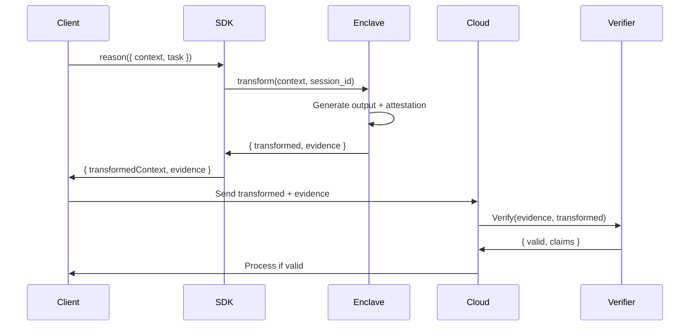

# Axiom Core Security Model (v0.x)

**Version:** 0.x  
**Last Updated:** 2026-01-18  
**Status:** Preview

**Note:** Enclave/attested content in this document is experimental preview only. It is opt-in, non-production, and does not provide v0.x guarantees.

---

## Overview

The Axiom Core v0.x implements a software-enforced semantic boundary. An experimental enclave preview explores TEE-based isolation and attestation. This document defines the threat model, security properties, and limitations of the system.

## Threat Model

### Assets to Protect

The following assets are considered sensitive and require protection:

1. **Raw User Context**
   - Original documents, messages, and records provided by users
   - Any text containing personally identifiable information (PII)
   - Business-sensitive data and confidential information

2. **Identity Mappings**
   - Relationships between original names/identifiers and synthetic entity IDs
   - The mapping table that allows "reinflation" of transformed context

3. **Transformation Internals** (optional protection in v0.x)
   - Intermediate representations during semantic analysis
   - Entity extraction patterns and heuristics

4. **Model Prompts with Sensitive Content**
   - Any prompt that contains raw user data
   - Must never leave the local environment in raw form

### Adversaries

The Axiom Core is designed to protect against the following threat actors:

#### 1. Network Attacker (External)

**Capabilities:**
- Observe all network traffic between client and cloud services
- Modify, replay, or drop network packets
- Perform man-in-the-middle attacks

**Limitations:**
- Cannot compromise the host operating system
- Cannot access TEE internals
- Cannot forge valid attestation reports

**Protection Mechanisms:**
- Raw data never transmitted over network (architectural property)
- Attestation evidence is intended to bind output to enclave execution
- TLS/mTLS recommended for transformed context transmission (out of SDK scope)

#### 2. Cloud Service / Model Provider (Honest-but-Curious)

**Capabilities:**
- Receive and analyze all data sent to cloud APIs
- Perform statistical analysis on transformed context
- Attempt semantic inference from entity relationships
- Log and persist all received data

**Limitations:**
- Cannot access raw input on local device
- Cannot access TEE internals
- Cannot forge attestation evidence

**Protection Mechanisms:**
- Only transformed, de-identified context reaches cloud services
- Semantic transformation preserves reasoning structure but removes identity
- Attestation evidence is intended to support verification that transformation occurred in TEE

#### 3. Host OS Attacker (Local, Privileged)

**Capabilities:**
- Inspect process memory outside of TEE
- Read filesystem, environment variables, logs
- Intercept system calls from non-enclave processes
- Observe resource usage patterns (CPU, memory, I/O)

**Limitations:**
- **Cannot access TEE memory** (hardware isolation)
- Cannot forge valid attestation reports
- Cannot modify enclave code without detection (measurement changes)

**Protection Mechanisms:**
- Critical transformation occurs inside AMD SEV-SNP TEE
- TEE memory is encrypted and isolated by hardware
- Attestation report includes measurement of enclave code
- SDK fails explicitly if TEE unavailable when `enclave: "required"`

#### 4. Malicious Integrator (Developer Misuse)

**Capabilities:**
- Attempt to bypass SDK safeguards
- Accidentally log or persist raw data
- Misconfigure security settings
- Send raw data directly to cloud (outside SDK)

**Limitations:**
- Cannot compromise TEE isolation
- Cannot bypass attestation requirements
- Cannot disable boundary checks within SDK

**Protection Mechanisms:**
- Fail-closed security model (explicit errors, no silent downgrades)
- Boundary enforcement at multiple layers (software + hardware)
- Clear API contracts with type-safe interfaces
- `attested` tier requires explicit opt-in

---

## Security Properties (In-Scope for v0.x)

### 1. Local-Only Raw Data Processing

**Property:** Raw input data does not leave the device or controlled environment through SDK-controlled code paths.

**Enforcement:**
- No network calls in SDK codebase (verified by `assertNoNetworkAccess()`)
- Boundary validation prevents serialization of raw text
- Enclave I/O is constrained (no filesystem, no network within TEE)

**Verification:** Static analysis + runtime boundary checks

### 2. TEE-Enforced Transformation

**Preview Property:** When `securityTier: "attested"` and `enclave: "required"`, semantic transformation is intended to occur inside the AMD SEV-SNP Trusted Execution Environment.

**Enforcement:**
- SDK routes transformation to native enclave runner
- Enclave runner validates TEE availability before execution
- Explicit failure if TEE unavailable

**Verification (preview):** Attestation report is intended to support verification that code ran in TEE

### 3. Cryptographic Attestation

**Preview Property:** Attestation evidence is intended to support verification of:
- **Code identity** (measurement of enclave binary)
- **Platform authenticity** (AMD SEV-SNP signature chain)
- **Output binding** (session_id, config_hash, output_hash)

**Enforcement:**
- AMD SEV-SNP hardware generates attestation report
- Report includes custom data binding session and output
- Signature chain validates to AMD root of trust

**Verification:** `AttestationVerifier` validates all claims

### 4. Explicit Failure on Unsafe Conditions

**Property:** The SDK fails loudly and explicitly when security invariants are violated. No silent downgrades or fallbacks.

**Enforcement:**
- `BoundaryViolationError` thrown if raw data detected in output
- `SecurityInvariantError` thrown if invariants violated
- `ConfigurationError` thrown if `enclave: "required"` but unavailable
- No try-catch that silently continues

**Verification:** Test suite validates failure modes

### 5. Deterministic Transformation

**Property:** Identical input produces identical output (for auditing and verification).

**Enforcement:**
- Canonical serialization with stable ordering
- Deterministic hashing (SHA-256)
- No randomness in entity extraction or masking

**Verification:** Determinism test suite

### 6. Session Binding

**Preview Property:** Attestation evidence is intended to bind a specific execution session and output to help detect replay.

**Enforcement:**
- Random 128-bit session ID generated per execution
- session_id, config_hash, output_hash embedded in attestation report
- Verifier checks binding integrity

**Verification:** Attestation binding tests

---

## Limitations & Out-of-Scope

### Explicitly NOT Protected Against

#### 1. Fully Compromised Firmware / Physical Attacks

**Threat:** Attacker has physical access and modifies firmware, BIOS, or hardware.

**Why Out-of-Scope:** 
- Requires physical access + sophisticated tools
- AMD SEV-SNP provides strong protection but not against all physical attacks
- Cost-benefit: extreme threat model beyond most use cases

**Mitigation Guidance:**
- Deploy in physically secure data centers
- Use secure boot and firmware verification
- Consider additional hardware security modules (HSM)

#### 2. Side-Channel Attacks Beyond Baseline

**Threat:** Timing attacks, cache analysis, speculative execution exploits (Spectre/Meltdown variants).

**Why Out-of-Scope:**
- Baseline mitigations assumed (OS-level, microcode updates)
- Advanced side-channel attacks require co-location and sophisticated measurement
- Performance cost of comprehensive mitigation too high for v0.x

**Mitigation Guidance:**
- Keep systems patched (CPU microcode, kernel, hypervisor)
- Use dedicated hardware when possible (no multi-tenancy)
- Monitor for abnormal resource usage

#### 3. Semantic Inference (Perfect Secrecy)

**Threat:** Attacker infers identity from relationship structure or statistical patterns in transformed context.

**Why Out-of-Scope:**
- Semantic transformation intentionally preserves reasoning structure
- Some information leakage inherent in utility-preserving anonymization
- Perfect secrecy would make LLM reasoning impossible

**Mitigation Guidance:**
- Understand semantic leakage risks for specific use cases
- Use minimal context (send only what's needed)
- Combine with differential privacy in future versions (v2.0+)

#### 4. Zero-Knowledge Proofs

**Threat:** Verifier learns intermediate values during verification.

**Why Out-of-Scope:**
- ZK proofs add significant complexity and performance cost
- v0.x focuses on attestation-based verification
- Planned for v2.0

**Mitigation Guidance:**
- Use local verification when possible
- If using remote verifier, trust verifier or use MPC (future work)

---

## Security Architecture

### Defense in Depth

Axiom implements multiple layers of security:

```
┌─────────────────────────────────────────────────────────────┐
│ Layer 4: Attestation Verification (Cryptographic Proof)     │
│  - AMD SEV-SNP signature chain validation                   │
│  - Measurement verification                                 │
│  - Output binding checks                                    │
└─────────────────────────────────────────────────────────────┘
                            ▼
┌─────────────────────────────────────────────────────────────┐
│ Layer 3: TEE Hardware Isolation (AMD SEV-SNP)               │
│  - Encrypted memory                                         │
│  - No host OS access to enclave                             │
│  - Attestation report generation                            │
└─────────────────────────────────────────────────────────────┘
                            ▼
┌─────────────────────────────────────────────────────────────┐
│ Layer 2: Boundary Enforcement (Software)                    │
│  - Explicit allow-list for serializable fields              │
│  - Raw text detection and rejection                         │
│  - Memory clearing (best-effort)                            │
└─────────────────────────────────────────────────────────────┘
                            ▼
┌─────────────────────────────────────────────────────────────┐
│ Layer 1: Secure Coding Practices                            │
│  - No network libraries imported                            │
│  - Type-safe interfaces                                     │
│  - Explicit error handling                                  │
└─────────────────────────────────────────────────────────────┘
```

### Trust Boundaries

1. **Client Application** (untrusted)
   - May misuse API or attempt to bypass protections
   - SDK enforces security regardless of caller behavior

2. **TypeScript SDK** (trusted for policy enforcement)
   - Enforces configuration and boundary checks
   - Coordinates enclave execution
   - No sensitive processing in JavaScript

3. **Enclave Runner** (trusted for execution)
   - Native Rust code with memory safety
   - Runs inside TEE when attested tier enabled
   - Generates attestation evidence

4. **AMD SEV-SNP Platform** (trusted for hardware isolation)
   - Provides memory encryption and isolation
   - Generates cryptographic attestation
   - Root of trust for measurement

5. **Cloud Services** (untrusted)
   - Receive only transformed, de-identified context
   - Cannot access raw data or TEE internals
   - Should verify attestation evidence

---

## Configuration Security

### Security Tiers

#### `securityTier: "standard"`

**Properties:**
- Software boundary enforcement
- No network calls
- Explicit failure on violations

**Use When:**
- TEE not available or not required
- Performance is critical
- Trust in host OS is acceptable

**Limitations:**
- Host OS can inspect transformation process
- No cryptographic attestation

#### `securityTier: "attested"`

**Properties (preview):**
- All `standard` tier properties
- TEE hardware isolation
- Attestation evidence intended for verification
- Verifiable execution

**Use When:**
- Handling highly sensitive data
- Regulatory compliance may require attestation (outside SDK scope)
- Zero-trust architecture

**Requirements:**
- AMD SEV-SNP capable hardware
- Enclave runner installed
- Configuration: `enclave: "required"` or `"auto"`

### Enclave Modes

#### `enclave: "none"`

Explicitly disables TEE, even if available. Transformation runs in standard process memory.

**Use:** Development, testing, or when TEE overhead unacceptable.

#### `enclave: "auto"`

Use TEE if available, otherwise fail (when `attested` tier) or continue (when `standard` tier).

**Use:** Deployments needing fallback behavior (preview).

#### `enclave: "required"`

Fail explicitly if TEE unavailable. No fallback.

**Use:** Maximum security posture, regulated environments.

---

## Operational Security

### Deployment Recommendations

1. **Confidential VM Pattern** (Recommended for v0.x)
   - Deploy SDK in AMD SEV-SNP confidential virtual machine
   - Client controls VM, cloud provider cannot access memory
   - Clear attestation story for enterprise compliance

2. **On-Device Execution**
   - Run SDK on user's device with local TEE
   - More complex distribution and support model
   - Best privacy (data never leaves device)

3. **Hybrid Architecture**
   - Sensitive data processed locally with attestation
   - Non-sensitive orchestration in cloud
   - Balance privacy, performance, and complexity

### Verification Workflow



### Security Monitoring

**Recommended Monitoring:**
- Log all `BoundaryViolationError` incidents (indicates attack or bug)
- Track attestation verification failures
- Monitor enclave availability metrics
- Alert on `enclave: "required"` failures

**Do NOT Log:**
- Raw input context
- Entity mappings
- Intermediate transformation steps

---

## Incident Response

### If Raw Data Leakage Suspected

1. **Immediate Actions:**
   - Stop affected systems
   - Preserve logs and evidence
   - Notify security team and affected users

2. **Investigation:**
   - Review boundary check logs
   - Analyze attestation evidence
   - Verify enclave execution occurred
   - Check for SDK bugs or misuse

3. **Remediation:**
   - Patch SDK if vulnerability found
   - Update measurements and re-attest
   - Rotate any compromised identifiers
   - Enhanced monitoring

### If Attestation Verification Fails

1. **Possible Causes:**
   - Measurement mismatch (code update without registry update)
   - Platform signature invalid (compromised platform)
   - Session binding broken (replay attack)
   - Clock skew (timestamp freshness)

2. **Response:**
   - Reject the output (do not use)
   - Investigate root cause
   - Update measurement registry if legitimate update
   - Report to AMD if platform signature invalid

---

## Future Security Enhancements (Roadmap)

### v1.x Planned Improvements

- Multi-platform TEE support (Intel TDX, Apple Secure Enclave)
- Remote attestation verification service
- Enhanced measurement registry with transparency log
- Automated vulnerability scanning in CI/CD

### v2.0 Security Goals

- Zero-knowledge proofs for verification
- Differential privacy integration
- Homomorphic encryption for cloud computation
- Advanced side-channel mitigations

---

## Security Contact

**For security vulnerabilities or concerns:**

- Email: security@axiominfra.cloud
- PGP Key: [Available on keybase.io/axiom]
- Response Time: 24-48 hours for critical issues

**For general security questions:**

- GitHub Discussions: [github.com/Axiom-Infra/axiom-core/discussions]
- Documentation: [docs.axiominfra.cloud/security]

---

## Version History

| Version | Date       | Changes |
|---------|------------|---------|
| 0.1.0   | 2026-01-18 | v0 MVP with software-only boundary enforcement |

---

**Document Classification:** Public  
**Review Cycle:** Quarterly or after significant security changes

